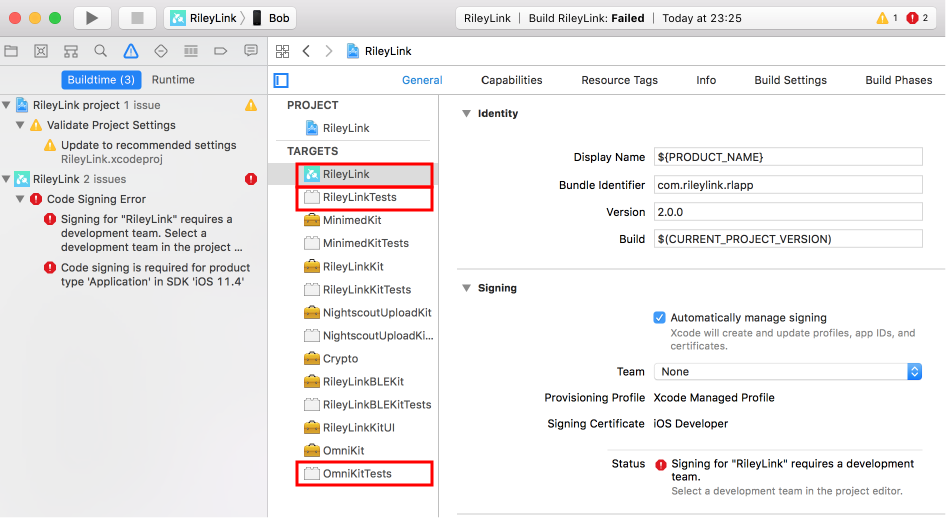
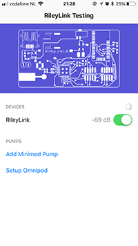
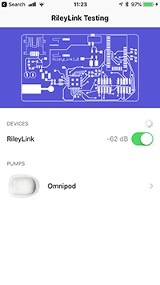
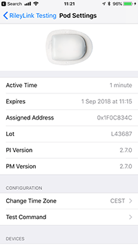

# RileyLink iOS App

[](https://gitter.im/ps2/rileylink?utm_source=badge&utm_medium=badge&utm_campaign=pr-badge&utm_content=badge) [](https://travis-ci.org/ps2/rileylink_ios)

The main purpose of the RileyLink iOS App is for developpers to test and build the device commands. The RileyLink iOS app connects to a [RileyLink](https://github.com/ps2/rileylink) via Bluetooth Low Energy (BLE, or Bluetooth Smart)

## Features
* Communicate with specific Medtronic Pumps dating before 2012. Read the [Loop documentation](https://loopkit.github.io/loopdocs/setup/requirements/pump/) for more information about which pumps are working.
* Communicate with the OmniPod. 
* Uploads CGM and pump data to a Nightscout instance via the REST API. The Nightscout web page is also displayed in the App.

## How to contibute
#### Test edge cases
Try to test as many use cases as possible by using the test command to send the command to the Pod. 
The test command line can be added here:
https://github.com/ps2/rileylink_ios/blob/omnikit/OmniKit/PodCommsSession.swift#L133

#### Create issues for failing test cases
If there is an error, create an Issue here https://github.com/ps2/rileylink_ios/issues with:
* A description which steps you took. 
* The console output from Xcode as a text snippet

If you own a RTL-SDR USB Device, also try to capture the radio messages as well and adding this to the Issue by using this capture program: https://github.com/Lytrix/openomni/tree/rtlomni which might help as well in trying to see what radio commands were send.

#### Add unit tests
You can also add your test as a unit test if there is no similiar test written yet here:
https://github.com/ps2/rileylink_ios/tree/omnikit/OmniKitTests

#### PR new communication commands or refactored code
And create a new [PR](https://help.github.com/articles/creating-a-pull-request-from-a-fork/) to the omnikit branch if you have created a new part in the communication commands.


**WARNING the PODs used will fail rapidly, so testing will require a lot of PODs.**

If you need test pods, please contact @jwedding on https://omniaps.slack.com/ or https://gitter.im/ps2/rileylink

## Getting Started

#### Flash the Rileylink Device
Flash your Rileylink device to version 2.0 or greater if you are using an earlier version using the dev branch of https://github.com/ps2/rileylink/tree/dev
subg_rfspy *and* ble113_rfspy (there are two chips) need to be flashed.

#### Clone this repo to your machine
```
git clone https://github.com/ps2/rileylink_ios.git
cd rileylink_ios
git checkout omnikit // To switch the branch or do it Xcode using the branch button in the menu on the top left.
```
#### Install the Rileylink iOS app to your phone

##### Install Xcode
You'll need Xcode, which is available for free, but will only build apps that last a week.  To make your apps run longer, you'll have to sign up for a developer account. Or send a message to @ps2 on gitter with your email address, and I'll add you to the distribution list and you can receive builds via testflight.

* Connect your iphone with a usb lightning connector to your laptop
* Select your iphone name at the top page pull down menu (it usually shows generic device)

You should not need to change bundle id, but you do have to sign the app by your team id on 3 places highlighted in red.  

* Then just clicking on the build and run button in Xcode should build and install the app to your connected phone.

### How to Use

To use the Rileylink, it has to connect to a Rileylink device first. If you don't see your RileyLink, close any app that uses the Rileylink or reboot your phone. 



#### Setup an Omnipod

Click on *Setup POD*.
Follow the same steps as with the PDM, but only push once to insert canula, else the Pod wil fail.

If all went well you should see something like this:



#### Test commands

To start testing commands you can edit the test command setting in xCode here and issue the command after rebuilding the app on your phone and push the test command button:


#### Setup a Medtronic pump

* Pump ID - Enter in your six digit pump ID

#### Setup Nightscout

* Nightscout URL - Should look like `http://mysite.azurewebsites.net`. You can use http or https.  Trailing slash or no trailing slash.
* Nightscout API Secret - Use the unhashed form, exactly specified in your `API_SECRET` variable.

To see treatments and pump data uploaded to nightscout, you'll need to be running the [dev branch](https://github.com/nightscout/cgm-remote-monitor/tree/dev) of cgm-remote-monitor.  You'll want to set the following Nightscout variables:

* DEVICESTATUS_ADVANCED = true
* ENABLE = pump openaps basal careportal iob
* PUMP_FIELDS = reservoir battery clock status

